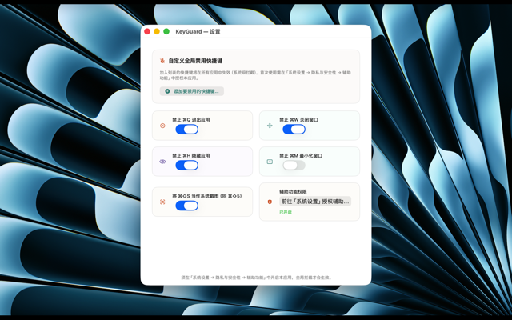
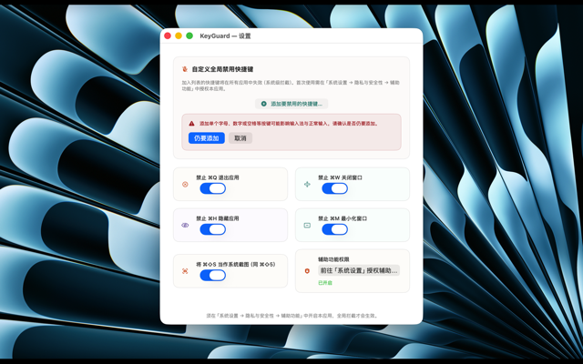

# KeyGuard

macOS 菜单栏小工具：防止误触 ⌘Q 退出、⌘W 关窗等系统快捷键，并支持自定义全局禁用快捷键。

---

## 功能

- **防误触**：可单独开关「禁止 ⌘Q 退出」「禁止 ⌘W 关窗」「禁止 ⌘H 隐藏」「禁止 ⌘M 最小化」
- **⌘⇧S 映射截图**：将 ⌘⇧S 映射为系统截图（与 ⌘⇧5 一致）
- **自定义全局禁用**：在设置中录制任意快捷键，加入列表后在所有应用中生效（系统级拦截）
- **运行时不显示在程序坞**：可选隐藏程序坞图标，仅通过菜单栏使用
- 支持简体中文、繁体中文、英文（Localizable.xcstrings）

---

## 系统要求

- macOS 13.5 及以上
- 需在 **系统设置 → 隐私与安全性 → 辅助功能** 中授权本应用，全局拦截才会生效

---

## 界面预览

| 说明 | 图片 |
|------|------|
| 菜单栏图标与菜单：点击可打开设置、切换防误触开关或退出应用。 |  |
| 设置窗口：开关各项防误触与 ⌘⇧S 截图映射，管理辅助功能权限与自定义全局禁用快捷键。 |  |
| 欢迎页 / 介绍：首次打开时可查看本应用用途与使用方法。 |  |

---

## 从源码构建

1. 克隆本仓库，用 Xcode 打开 `KeyGuard.xcodeproj`
2. 在 **Signing & Capabilities** 中为 KeyGuard、KeyGuardTests、KeyGuardUITests 选择你的 **Team**
3. 选择目标 **My Mac**，⌘B 构建，⌘R 运行

构建产物为菜单栏应用，首次运行会打开设置窗口；通过菜单栏图标可再次打开设置或退出。

---

## 项目结构

```
KeyGuard/
├── KeyGuard/           # 主应用
│   ├── KeyGuardApp.swift
│   ├── AppDelegate.swift
│   ├── SettingsView.swift
│   ├── DisabledShortcutsStore.swift
│   ├── Localizable.xcstrings
│   └── Assets.xcassets
├── KeyGuardTests/
├── KeyGuardUITests/
├── KeyGuard-Info.plist
└── KeyGuard.xcodeproj
```
